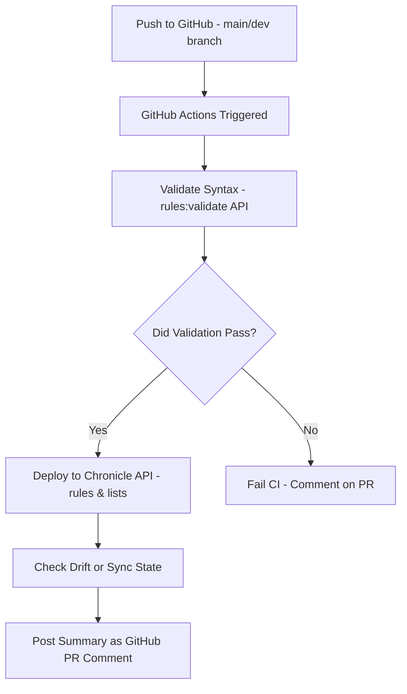

# Detection-as-Code Lab (Google SecOps-Inspired)

This project simulates the Detection-as-Code (DaC) lifecycle as it would operate in a Google Chronicle SecOps environment, all without needing access to a Chronicle license.

Instead, I’ve reverse-engineered the expected detection flow using:

* UDM-compatible synthetic logs
* Custom Python detection logic
* YAML/YARA-L rules
* Terraform-like IaC definitionsReference lists and CI-style simulation

The goal is to mirror a real-life cloud-scale detection pipeline and demonstrate deep understanding of how Chronicle rules, log ingestion, and alert triage work.

### Project Structure
```
.
├── `docker-log-generator/`      # Emits mock UDM logs to Fluentd
├── `fluentd/`                  # Collects and buffers logs locally
├── `processed-logs/udm_log/`    # Log sink (simulates Chronicle UDM ingestion)
├── `scripts/`                   # Custom Python logic to match logs with rules
├── `rules/`                     # YARA-L and YAML rule definitions
├── `reference_lists/`           # Chronicle-style reference lists (IP ranges, etc.)
├── `terraform/`                 # Example rule and datasource definitions (Chronicle-like)
├── `secops_rules.yaml`          # DaC-friendly YAML defining rules to deploy
├── `secops_reference_lists.yaml`
├── `alerts/`                    # Simulated alerts generated from matching rules
├── `docs/`                      # Technical documentation
├── `Makefile`                   # Easy CLI for bringing the system up/down
└── `tests/`                     # Rule test cases
```

### Project Goal

Engineering:
* Sample UDM event generation
* Log forwarding via Fluentd
* Python detection engine to process and alert

Detection Life Cycle Management:
* Detection logic in YARA-L format
* Terraform IaC to manage rules and data sources
* Simulated GitOps model for lifecycle management


### High-Level Architecture


#### Step 1: Log Generation
Logs are emitted by `docker-log-generator/log_emitter.py`, simulating user activity like `logins`, `admin changes`, `geolocation anomalies`, etc. The logs are already UDM-shaped (based on Chronicle’s Unified Data Model) and pushed to Fluentd:
```
{
  "metadata": {
    "event_timestamp": "2025-08-06T12:34:56Z",
    ...
  },
  "principal": {
    "ip": "8.8.8.8",
    "location": {
      "country_or_region": "RU"
    },
    ...
  },
  "security_result": {
    "action": "LOGIN_SUCCESS",
    ...
  }
}
```

#### Step 2: Log Parsing + Matching
Logs are consumed by a custom Python engine in `scripts/match_logs_from_fluentd.py`, which performs:

* UDM field normalization
```
{"metadata":{"event_timestamp":"2025-08-06T13:07:12.122409+00:00","ingested_timestamp":"2025-08-06T13:07:12.122409+00:00"},"product":"gcp","event_type":"LOGIN","vendor_name":"Google","principal":{"email_addresses":["user1@example.com"],"ip":"103.27.4.178","hostname":"host-103-27-4-178.reliancejio.com"},"geo":{"country":"IN","is_admin":true},"network":{"asn":"AS55410","asn_name":"Reliance Jio","ip":"103.27.4.178","reverse_dns":"host-103-27-4-178.reliancejio.com"},"security_result":{"severity":"HIGH","rule_name":"None"}}
```

* Matching UDM fields against rule conditions
* Cross-referencing with reference lists (e.g., internal IP ranges)
* Emitting alerts to the alerts/ folder

This simulates what Chronicle’s Detection Engine would do using the YARA-L rule format.


#### Step 3: Rules & Reference Lists
YAML/YARA-L Rules define detection logic:
```
rule: impossible_travel
condition: |
  principal.ip NOT IN private_ip_ranges.txt AND
  principal.location.country_or_region CHANGED_WITHIN 1 HOUR
severity: HIGH
type: anomaly
```
Reference list example (reference_lists/private_ip_ranges.txt):
```
10.0.0.0/8
192.168.0.0/16
```

#### Step 4: Alerts & Tests
If a match is found, alerts are generated to the `alerts/` folder in JSON format. You can also run test cases in `tests/` against your rules.

New Detection: `impossible_travel_alerts`
```json
{
  "metadata": {
    "event_timestamp": "2025-08-06T13:07:14.148646+00:00",
    "ingested_timestamp": "2025-08-06T13:07:14.148646+00:00"
  },
  "locations": [
    {
      "ip": "3.32.132.92",
      "hostname": "host-3-32-132-92.googlellc.com",
      "geo": {
        "country": "US",
        "is_admin": true
      }
    },
    {
      "ip": "142.112.180.19",
      "hostname": "host-142-112-180-19.teluscommunicationsinc.com",
      "geo": {
        "country": "CA",
        "is_admin": true
      }
    }
  ],
  "note": "Two admin logins from different locations within the same second"
}
```

New Detection: `high_volume_login_alerts`

```json
[
  {
    "rule_name": "High Volume Login from CA",
    "severity": "MEDIUM",
    "event_count": 15,
    "events": [
      {
        "metadata": {
          "event_timestamp": "2025-08-06T13:07:29.552018+00:00",
          "ingested_timestamp": "2025-08-06T13:07:29.552018+00:00"
        },
        "product": "gcp",
        "event_type": "LOGIN",
        "vendor_name": "Google",
        "principal": {
          "email_addresses": [
            "user4@example.com"
          ],
          "ip": "184.108.217.157",
          "hostname": "host-184-108-217-157.teluscommunicationsinc..com"
        },
        "geo": {
          "country": "CA",
          "is_admin": true
        },
        "network": {
          "asn": "AS852",
          "asn_name": "TELUS Communications Inc.",
          "ip": "184.108.217.157",
          "reverse_dns": "host-184-108-217-157.teluscommunicationsinc..com"
        },
        "security_result": {
          "severity": "HIGH",
          "rule_name": "None"
        }
      },
```

#### Step 5: Terraform Emulation
The `terraform/` folder simulates how you would actually deploy your resources in a real world environment using the Chronicle API. Each rule can be defined in `.tf` files and governed via secops_rules.yaml.

You would need to add the UDM fields that are populated for your datasources in here:

File Name: `gcp_audit_logsource.tf`


In a real Chronicle deployment, these `.tf` files would use the Chronicle Terraform provider to push rules via API.

### Summary
#### How would leveraging Chronicle API help with Detection-as-Code

This is a more focused table of Chronicle APIs that will be useful for creating, updating, validating and managing detection content like rules, reference lists and data sources.
```
| Resource Type             | Endpoint                                       | Method   | Description                      | DaC Use Case                                                   |
| ------------------------- | ---------------------------------------------- | -------- | -------------------------------- | -------------------------------------------------------------- |
| **Detection Rules**       | `/v1/detect/rules`                             | `POST`   | Create new YARA-L detection rule | Create rule from GitHub-pushed code                            |
|                           | `/v1/detect/rules/{rule_id}`                   | `PATCH`  | Update an existing rule          | Update rule when a PR is merged                                |
|                           | `/v1/detect/rules/{rule_id}`                   | `DELETE` | Delete a rule                    | Remove deprecated or broken rules                              |
|                           | `/v1/detect/rules`                             | `GET`    | List all existing rules          | Validate drift between Git and Chronicle                       |
|                           | `/v1/detect/rules:validate`                    | `POST`   | Validate rule syntax (dry run)   | Lint rule pre-merge or CI check                                |
| **Rule Alert Counts**     | `/v1/detect/rules/{rule_id}:getAlertStats`     | `GET`    | Get alert stats (volume)         | Prioritize tuning noisy rules                                  |
| **Rule Execution Logs**   | `/v1/detect/rules/{rule_id}:getExecutionStats` | `GET`    | Get match execution stats        | Analyze performance of rules                                   |
| **Reference Lists**       | `/v1/detect/referenceLists`                    | `POST`   | Create new reference list        | Add threat intel or allowlists from Git                        |
|                           | `/v1/detect/referenceLists/{list_id}`          | `PATCH`  | Update reference list            | Update indicators/IPs regularly                                |
|                           | `/v1/detect/referenceLists`                    | `GET`    | List all reference lists         | Audit existing lists vs repo                                   |
|                           | `/v1/detect/referenceLists/{list_id}`          | `DELETE` | Delete reference list            | Remove stale lists                                             |
| **Data Sources**          | `/v2/assets/dataSources`                       | `POST`   | Create new data source           | Register new log sources programmatically                      |
|                           | `/v2/assets/dataSources`                       | `GET`    | List data sources                | Validate ingestion sources match code                          |
| **Parsers (UDM Mapping)** | `/v1/ingestion/parsers` *(limited access)*     | `POST`   | Deploy custom parsers            | Align parser changes with rule logic (requires partner access) |
| **Detection Reports**     | `/v1/detect/reports`                           | `GET`    | Retrieve rule reports            | Track rule health and triage history                           |
| **Auth (OAuth2)**         | `https://oauth2.googleapis.com/token`          | `POST`   | Get access token for API         | Required for all programmatic DaC actions                      |
```

Template Chronicle Github Repo
```
.
├── .github/
│   └── workflows/
│       └── detect.yaml         <-- CI/CD pipeline
├── rules/
│   ├── detection_rule_1.yaral
│   ├── detection_rule_2.yaral
│   └── metadata.yaml
├── reference_lists/
│   └── high_risk_ips.yaml
├── tests/
│   └── test_rules.py           <-- (optional) unit tests
├── tools/
│   └── push_to_chronicle.py    <-- Helper script for API calls
├── README.md
└── terraform/                  <-- Optional DaC Terraform setup
```

#### Potential CI/CD pipeline flow



