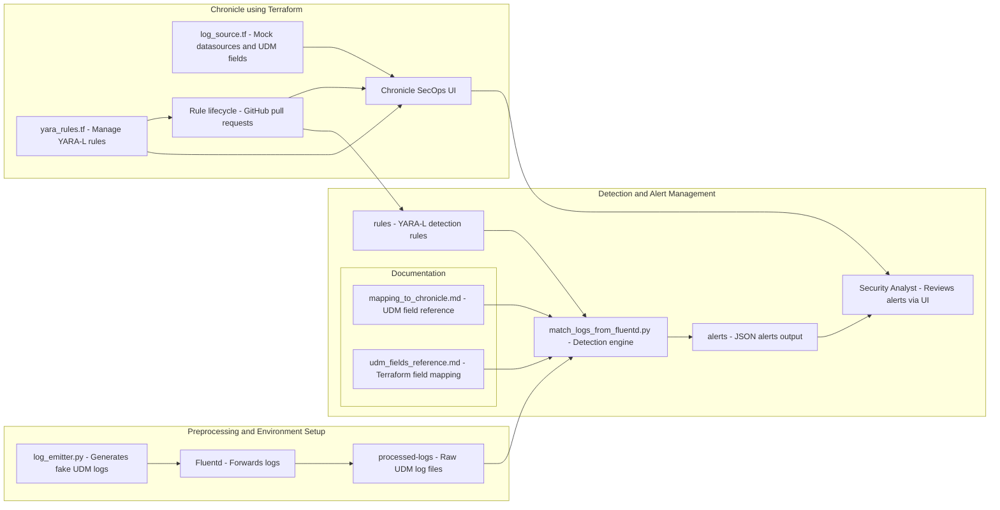

This repo emulates how you would potentially leverage Google SecOps with a Detection-as-Code (DaC) approach:

* Sample UDM event generation
* Log forwarding via Fluentd
* Python detection engine to process and alert

* Detection logic in YARA-L format
* Terraform IaC to manage rules and data sources
* Simulated GitOps model for lifecycle management

### How It Works:

This is a full end-to-end simulation of what a Detection-as-Code pipeline would look like, and how it can be used to leverage Google SecOps. It involves:

* UDM Log Generation: Simulates endpoint or authentication events
* Fluentd Forwarding: Parses and forwards structured logs
* Detection Matching: Python engine applies YARA-L logic
* Alert Output: Alerts written to /alerts folder per rule
* Terraform Support: Template for how this would be leveraged in a production environment

### High-Level Architecture:

### Emulation Details:

Preprocessing:
* log_emitter.py generates random UDM-compliant logs.
* Events simulate IAM, endpoint, and network behaviors.

Fluentd:
* Acts like a real forwarder agent.
* Forwards logs to processed-logs/.

Detection Matching:
* match_logs_from_fluentd.py reads logs.
* Applies all rules from rules/*.yml.
* Outputs matching alerts to alerts/.

Alert Output:
* Alerts are deduplicated and throttled per source country.
* Output is timestamped and grouped.
* Alerts are visible as JSON objects with field references.

